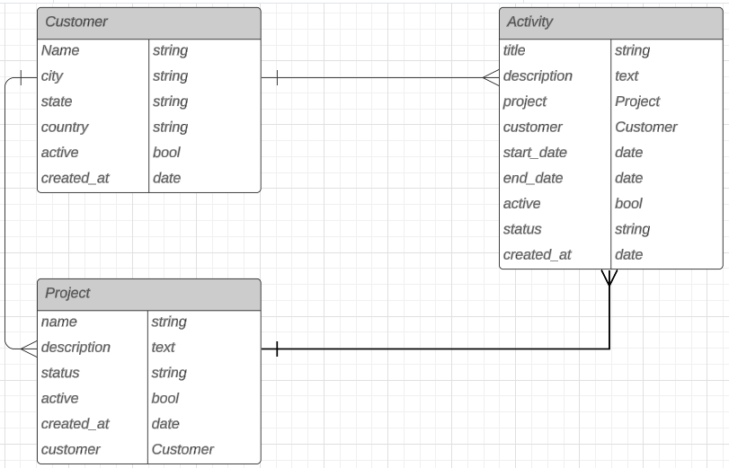

# AGmanager


## Como rodar o projeto
Certifique-se de ter docker e docker-compose instalado.

execute:
```
docker-compose up --build
```
A aplicação estará sendo executada na porta `:8000`


## Executando testes

Os containers não precisam estar sendo executados para rodar os testes, apenas instale as dependencias do pipfile com:
```
pipenv shell
pipenv install
```
Os testes pode ser executados com o comando `pytest` ou de forma mais detalhada com `pytest -vv`

Para checar cobertura de testes execute:
```
pytest --cov=core core/tests/
```

Para ver detalhes da cobertura execute:

```
pytest --cov=core core/tests/ --cov-report html
```

isso irá criar uma pasta html no diretório onde haverá um index.html contendo a cobertura de todos os arquivos do projeto.

## Rotas

### Customer

POST `api/customers/`
```
{
  "name": "string",
  "city": "string",
  "state": "string",
  "country": "string",
  "active": true
}
```

GET `api/customers/`

<details>
<summary>response example:</summary>

```
{
	"count": 1,
	"next": null,
	"previous": null,
	"results": [
		{
			"id": 1,
			"name": "atrox",
			"city": "Mould-on-the-Wold",
			"state": "Gloucestershire",
			"country": "England",
			"active": true,
			"created_at": "2024-05-23T01:48:47.086747Z"
		}
	]
}
```
</details>

PATCH `api/customers/{customer_id}`

campos disponíveis:
```
{
  "name": "string",
  "city": "string",
  "state": "string",
  "country": "string",
  "active": boolean
}
```

DELETE `api/customers/{customer_id}/`

### Projects

POST `api/projects/`
```
{
  "name": "string",
  "description": "string",
  "status": "string",
  "active": boolean,
  "customer": int (id)
}
```

GET `/api/projects/`


<details>
<summary>response example:</summary>

```
{
  "count": 123,
  "next": "http://api.example.org/accounts/?page=4",
  "previous": "http://api.example.org/accounts/?page=2",
  "results": [
    {
      "id": 0,
      "activities": [
        {
          "id": 0,
          "title": "string",
          "description": "string",
          "start_date": "2024-05-23",
          "end_date": "2024-05-23",
          "active": true,
          "status": "not_started",
          "created_at": "2024-05-23T17:31:02.897Z",
          "project": 0,
          "customer": 0
        }
      ],
      "name": "string",
      "description": "string",
      "status": "not_started",
      "active": true,
      "created_at": "2024-05-23T17:31:02.897Z",
      "customer": 0
    }
  ]
}
```
</details>

GET `/api/customers/{customer_id}/projects/?status=`

os status para filtro podem ser `not_started`,`in_progress`, `completed`, `on_hold`

<details>
<summary>response example:</summary>

```
{
	"count": 1,
	"next": null,
	"previous": null,
	"results": [
		{
			"id": 1,
			"activities": [
				{
					"id": 1,
					"title": "Random activity",
					"description": "random",
					"start_date": "2023-10-10",
					"end_date": null,
					"active": true,
					"status": "not_started",
					"created_at": "2024-05-23T17:41:51.260404Z",
					"project": 1,
					"customer": 1
				}
			],
			"name": "Order of the phoenix",
			"description": "Random description",
			"status": "not_started",
			"active": true,
			"created_at": "2024-05-23T17:36:32.654363Z",
			"customer": 1
		}
	]
}
```
</details>

PATCH `api/projects/{project_id}/`

campos disponíveis:
```
{
  "name": "string",
  "description": "string",
  "status": "string",
  "active": boolean,
  "customer": int (id)
}
```

DELETE `api/projects/{project_id}/`

### Activities

POST `/api/activities/`
```
{
  "title": "string",
  "description": "string",
  "start_date": date,
  "end_date": date,
  "active": boolean,
  "status": "string",
  "project": int (id),
  "customer": int (id)
}
```

DELETE `/api/activities/{id}/`

GET `/api/customers/{customer_id}/projects/{project_pk}/activities/`

<details>
<summary>response example:</summary>

```
{
	"count": 2,
	"next": null,
	"previous": null,
	"results": [
		{
			"id": 1,
			"title": "Random activity 1",
			"description": "random",
			"start_date": "2024-05-21",
			"end_date": null,
			"active": true,
			"status": "not_started",
			"created_at": "2024-05-23T19:24:00.750000Z",
			"project": 1,
			"customer": 1
		},
		{
			"id": 2,
			"title": "Random activity 2",
			"description": "random",
			"start_date": "2024-05-21",
			"end_date": null,
			"active": true,
			"status": "not_started",
			"created_at": "2024-05-23T19:24:04.190000Z",
			"project": 1,
			"customer": 1
		}
	]
}
```
</details>

GET `/api/projects/{project_pk}/activities/`

<details>
<summary>response example:</summary>

```
{
  "count": 123,
  "next": "http://api.example.org/accounts/?page=4",
  "previous": "http://api.example.org/accounts/?page=2",
  "results": [
    {
      "id": 0,
      "title": "string",
      "description": "string",
      "start_date": "2024-05-23",
      "end_date": "2024-05-23",
      "active": true,
      "status": "not_started",
      "created_at": "2024-05-23T18:05:04.603Z",
      "project": 0,
      "customer": 0
    }
  ]
}
```
</details>

GET `/api/projects/{project_pk}/activities/{id}/`

<details>
<summary>response example:</summary>

```
{
  "id": 0,
  "title": "string",
  "description": "string",
  "start_date": "2024-05-23",
  "end_date": "2024-05-23",
  "active": true,
  "status": "not_started",
  "created_at": "2024-05-23T18:05:53.782Z",
  "project": 0,
  "customer": 0
}
```
</details>

PATCH `api/activity/{activity_id}/`

```
{
  "title": "string",
  "description": "string",
  "status": "string",
  "active": boolean,
  "start_date": date,
  "end_date": date,
}
```


## Diagrama


